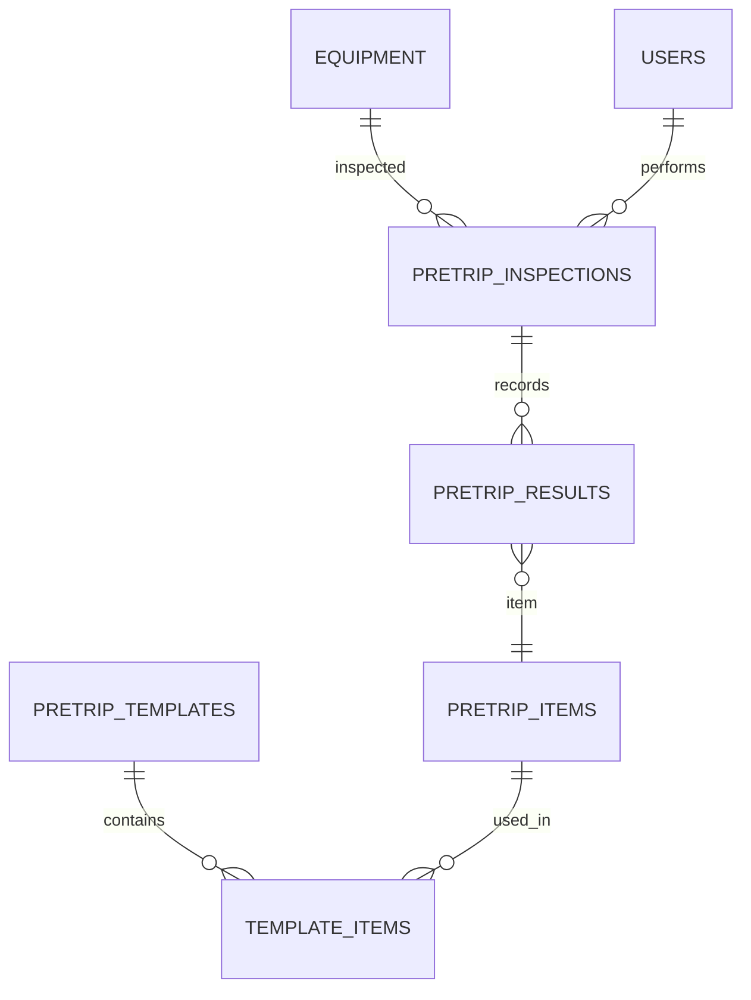

# 📑 Database Schema Documentation: *Pretrip_flask*

This document provides a detailed breakdown of the database schema, derived from the SQLAlchemy models in `flask_app/models/`. It is intended to be a comprehensive reference for developers.

---

## Overall Architecture & ERD

The database is organized into four main logical groups: Users, Pretrip Inspections, SpeedGauge Analytics, and Tank & Fuel Management.



---

## 👤 Users Model (`users.py`)

Handles user authentication and profile information.

### **Users**

*   **Table:** `users`
*   **Schema:** `pretrip_db`
*   **Columns:**
    *   `id`: `Integer`, **Primary Key**
    *   `username`: `String(255)`, **Unique, Required**
    *   `password`: `String(255)`, **Required**
    *   `role`: `String(50)`, Default: `'standard'`
*   **Relationships:**
    *   `inspections` (One-to-Many) → `PretripInspection`

---

## 🛠 Pretrip Models (`pretrip.py`)

A relational system for conducting and recording equipment inspections.

### **Equipment**
*   **Table:** `equipment`
*   **Columns:**
    *   `id`: `Integer`, **Primary Key**
    *   `name`: `String(255)`, **Unique, Required**
    *   `default_template_id`: `Integer`, **FK** → `pretrip_templates.id`
*   **Relationships:**
    *   `inspections` (One-to-Many) → `PretripInspection`

### **PretripTemplate**
*   **Table:** `pretrip_templates`
*   **Columns:**
    *   `id`: `Integer`, **Primary Key**
    *   `name`: `String(255)`, **Unique, Required**
*   **Relationships:**
    *   `items` (Many-to-Many) → `PretripItem` (via `TemplateItem`)

### **PretripItem**
*   **Table:** `pretrip_items`
*   **Columns:**
    *   `id`: `Integer`, **Primary Key**
*   **Relationships:**
    *   `results` (One-to-Many) → `PretripResult`

### **TemplateItem** (Association Table)
*   **Table:** `template_items`
*   **Columns:**
    *   `template_id`: `Integer`, **PK, FK** → `pretrip_templates.id`
    *   `item_id`: `Integer`, **PK, FK** → `pretrip_items.id`
    *   `display_order`: `Integer`

### **PretripInspection**
*   **Table:** `pretrip_inspections`
*   **Columns:**
    *   `id`: `Integer`, **Primary Key**
    *   `equipment_id`: `Integer`, **FK** → `equipment.id`, **Required**
    *   `user_id`: `Integer`, **FK** → `users.id`, **Required**
    *   `inspection_datetime`: `DateTime`, **Indexed**
*   **Relationships:**
    *   `results` (One-to-Many) → `PretripResult`

### **PretripResult**
*   **Table:** `pretrip_results`
*   **Columns:**
    *   `id`: `Integer`, **Primary Key**
    *   `inspection_id`: `Integer`, **FK** → `pretrip_inspections.id`, **Required**
    *   `item_id`: `Integer`, **FK** → `pretrip_items.id`, **Required**
    *   `item_snapshot`: `JSON`. Snapshot of the item at the time of inspection.
    *   `severity`: `Enum('ok', 'defect', 'action_required')`
*   **Relationships:**
    *   `photos` (One-to-Many) → `PretripPhoto`

### **PretripPhoto**
*   **Table:** `pretrip_photos`
*   **Columns:**
    *   `id`: `Integer`, **Primary Key**
    *   `result_id`: `Integer`, **FK** → `pretrip_results.id`, **Required**
    *   `file_path`: `String(255)`, **Required**. Should be a URL or storage identifier (e.g., S3 path).

---

## DB Constraints & Indexes

*   **Unique Constraints:**
    *   `equipment.name`
    *   `pretrip_templates.name`
    *   `template_items`: `(template_id, display_order)`
*   **Indexes:**
    *   `pretrip_inspections.inspection_datetime`
*   **ON DELETE Behavior:**
    *   `template_items` → `CASCADE` on template/item deletion.
    *   `pretrip_results` → `CASCADE` on inspection deletion.
    *   `pretrip_photos` → `CASCADE` on result deletion.
    *   `pretrip_results.item_id` → `RESTRICT` deletion of items that have results.
    *   `equipment.default_template_id` & `pretrip_inspections.template_id` → `SET NULL` on template deletion.

---

## Security

*   **Password Hashing:** Passwords must be hashed using `werkzeug.security.generate_password_hash` before being stored.
*   **File Storage:** The application should not store absolute file paths. `file_path` in `pretrip_photos` should be a URL or a cloud storage identifier. The application is responsible for cleaning up storage when a photo record is deleted.

---

## Migrations, Backup & Restore

*   **Migrations:** Run `flask db migrate -m "description"` and `flask db upgrade`. Always review auto-generated migrations.
*   **Backup:** `mysqldump -u [user] -p [database] | gzip > backup.gz`
*   **Restore:** `gunzip < backup.gz | mysql -u [user] -p [database]`

---
## Validation

*   **Tread Depth:** The `numeric_value` for tread depth should be validated with a regex like `^\d+/\d+$`.
    ```python
    import re
    def valid_tread(value):
        return bool(re.match(r'^\d+/\d+$', value))
    ```
