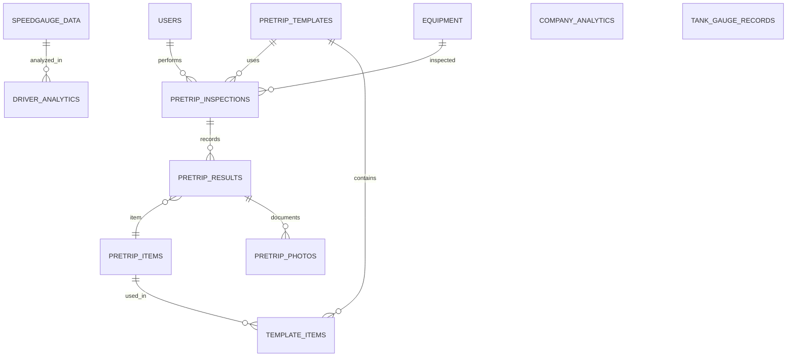

# 📑 Database Schema Documentation: *Pretrip_flask*

This document provides a detailed breakdown of the database schema, derived from the SQLAlchemy models in `flask_app/models/`. It is intended to be a comprehensive reference for developers.

---

## Overall Architecture & ERD

The database is organized into four main logical groups: Users, Pretrip Inspections, SpeedGauge Analytics, and Tank & Fuel Management.

---

## 👤 Users Model (`users.py`)

Handles user authentication and profile information.

### **Users**

*   **Table:** `users`
*   **Schema:** `pretrip_db`
*   **Columns:**
    *   `id`: `Integer`, **Primary Key**, Auto-incrementing
    *   `username`: `String(255)`, **Unique, Required**
    *   `password`: `String(255)`, **Required** (stores hash)
    *   `creation_timestamp`: `DateTime`, Default: `CURRENT_TIMESTAMP`
    *   `first_name`: `String(255)`, Optional
    *   `last_name`: `String(255)`, Optional
    *   `driver_id`: `String(255)`, Optional
    *   `admin_level`: `Integer`, Default: `0`
    *   `dot_number`: `String(255)`, Optional
    *   `role`: `String(50)`, Default: `'standard'`
*   **Relationships:**
    *   `inspections` (One-to-Many) → `PretripInspection`

---

## 🛠 Pretrip Models (`pretrip.py`)

A relational system for conducting and recording equipment inspections.

### **Equipment**
*   **Table:** `equipment`
*   **Columns:**
    *   `id`: `Integer`, **Primary Key**, Auto-incrementing
    *   `name`: `String(255)`, **Unique, Required**
    *   `equipment_type`: `String(255)`, **Required**
    *   `description`: `Text`, Optional
    *   `created_at`: `DateTime`, Default: `CURRENT_TIMESTAMP`
    *   `updated_at`: `DateTime`, Default: `CURRENT_TIMESTAMP`, On Update: `CURRENT_TIMESTAMP`
    *   `default_template_id`: `Integer`, **FK** → `pretrip_templates.id` (On Delete: `SET NULL`)
*   **Relationships:**
    *   `default_template` (Many-to-One) → `PretripTemplate`
    *   `inspections` (One-to-Many) → `PretripInspection`

### **PretripItem**
*   **Table:** `pretrip_items`
*   **Columns:**
    *   `id`: `Integer`, **Primary Key**, Auto-incrementing
    *   `equipment_id`: `Integer`, **FK** → `equipment.id`, Optional
    *   `section`: `String(255)`, Optional
    *   `name`: `String(255)`, **Required**
    *   `details`: `Text`, Optional
    *   `notes`: `Text`, Optional
    *   `date_field_required`: `Boolean`, Default: `False`
    *   `numeric_field_required`: `Boolean`, Default: `False`
    *   `boolean_field_required`: `Boolean`, Default: `False`
    *   `text_field_required`: `Boolean`, Default: `False`
    *   `created_at`: `DateTime`, Default: `CURRENT_TIMESTAMP`
    *   `updated_at`: `DateTime`, Default: `CURRENT_TIMESTAMP`, On Update: `CURRENT_TIMESTAMP`
*   **Relationships:**
    *   `templates` (Many-to-Many) → `PretripTemplate` (via `TemplateItem`)
    *   `results` (One-to-Many) → `PretripResult`

### **PretripTemplate**
*   **Table:** `pretrip_templates`
*   **Columns:**
    *   `id`: `Integer`, **Primary Key**, Auto-incrementing
    *   `name`: `String(255)`, **Unique, Required**
    *   `description`: `Text`, Optional
    *   `equipment_type`: `String(255)`, Optional
    *   `created_at`: `DateTime`, Default: `CURRENT_TIMESTAMP`
    *   `updated_at`: `DateTime`, Default: `CURRENT_TIMESTAMP`, On Update: `CURRENT_TIMESTAMP`
*   **Relationships:**
    *   `items` (Many-to-Many) → `PretripItem` (via `TemplateItem`)
    *   `default_for_equipments` (One-to-Many) → `Equipment`
    *   `inspections` (One-to-Many) → `PretripInspection`

### **TemplateItem** (Association Table)
*   **Table:** `template_items`
*   **Columns:**
    *   `template_id`: `Integer`, **PK, FK** → `pretrip_templates.id` (On Delete: `CASCADE`)
    *   `item_id`: `Integer`, **PK, FK** → `pretrip_items.id` (On Delete: `CASCADE`)
    *   `display_order`: `Integer`, Default: `0`
    *   `required_override`: `Boolean`, Optional
    *   `input_type_override`: `String(50)`, Optional

### **PretripInspection**
*   **Table:** `pretrip_inspections`
*   **Columns:**
    *   `id`: `Integer`, **Primary Key**, Auto-incrementing
    *   `equipment_id`: `Integer`, **FK** → `equipment.id` (On Delete: `RESTRICT`), **Required, Indexed**
    *   `user_id`: `Integer`, **FK** → `users.id` (On Delete: `RESTRICT`), **Required, Indexed**
    *   `template_id`: `Integer`, **FK** → `pretrip_templates.id` (On Delete: `SET NULL`), Optional
    *   `inspection_datetime`: `DateTime`, Default: `CURRENT_TIMESTAMP`, **Indexed**
    *   `notes`: `Text`, Optional
    *   `created_at`: `DateTime`, Default: `CURRENT_TIMESTAMP`
    *   `updated_at`: `DateTime`, Default: `CURRENT_TIMESTAMP`, On Update: `CURRENT_TIMESTAMP`
*   **Relationships:**
    *   `results` (One-to-Many) → `PretripResult`
    *   `equipment` (Many-to-One) → `Equipment`
    *   `user` (Many-to-One) → `Users`
    *   `template` (Many-to-One) → `PretripTemplate`

### **PretripResult**
*   **Table:** `pretrip_results`
*   **Columns:**
    *   `id`: `Integer`, **Primary Key**, Auto-incrementing
    *   `inspection_id`: `Integer`, **FK** → `pretrip_inspections.id` (On Delete: `CASCADE`), **Required, Indexed**
    *   `item_id`: `Integer`, **FK** → `pretrip_items.id` (On Delete: `RESTRICT`), **Required, Indexed**
    *   `item_snapshot`: `JSON`, Optional
    *   `boolean_value`: `Boolean`, Optional
    *   `numeric_value`: `String(50)`, Optional
    *   `date_value`: `Date`, Optional
    *   `text_value`: `Text`, Optional
    *   `notes`: `Text`, Optional
    *   `severity`: `Enum('ok', 'defect', 'action_required')`, Optional
    *   `created_at`: `DateTime`, Default: `CURRENT_TIMESTAMP`
    *   `updated_at`: `DateTime`, Default: `CURRENT_TIMESTAMP`, On Update: `CURRENT_TIMESTAMP`
*   **Relationships:**
    *   `inspection` (Many-to-One) → `PretripInspection`
    *   `item` (Many-to-One) → `PretripItem`
    *   `photos` (One-to-Many) → `PretripPhoto`

### **PretripPhoto**
*   **Table:** `pretrip_photos`
*   **Columns:**
    *   `id`: `Integer`, **Primary Key**, Auto-incrementing
    *   `result_id`: `Integer`, **FK** → `pretrip_results.id` (On Delete: `CASCADE`), **Required**
    *   `file_path`: `String(255)`, **Required**
    *   `uploaded_at`: `DateTime`, Default: `CURRENT_TIMESTAMP`
    *   `description`: `Text`, Optional
*   **Relationships:**
    *   `result` (Many-to-One) → `PretripResult`

---

## 🏎️ SpeedGauge Models (`speedgauge.py`)

Stores and analyzes driver performance data from SpeedGauge reports.

### **SpeedGaugeData**
*   **Table:** `speedGauge_data`
*   **Columns:**
    *   `id`: `Integer`, **Primary Key**, Auto-incrementing
    *   `driver_name`: `String(255)`
    *   `first_name`: `String(255)`
    *   `last_name`: `String(255)`
    *   `driver_id`: `Integer`
    *   `vehicle_type`: `String(255)`
    *   `percent_speeding`: `DECIMAL(5,2)`
    *   `is_interpolated`: `Integer`
    *   `max_speed_non_interstate_freeway`: `DECIMAL(6,2)`
    *   `percent_speeding_non_interstate_freeway`: `DECIMAL(5,2)`
    *   `worst_incident_date`: `DateTime`
    *   `incident_location`: `Text`
    *   `speed_limit`: `Integer`
    *   `speed`: `Integer`
    *   `speed_cap`: `String(255)`
    *   `custom_speed_restriction`: `String(255)`
    *   `distance_driven`: `Integer`
    *   `url`: `String(2048)`
    *   `url_lat`: `DECIMAL(10,8)`
    *   `url_lon`: `DECIMAL(11,8)`
    *   `location`: `String(255)`
    *   `percent_speeding_numerator`: `DECIMAL(10,2)`
    *   `percent_speeding_denominator`: `DECIMAL(10,2)`
    *   `max_speed_interstate_freeway`: `DECIMAL(6,2)`
    *   `percent_speeding_interstate_freeway`: `DECIMAL(5,2)`
    *   `incidents_interstate_freeway`: `Integer`
    *   `observations_interstate_freeway`: `Integer`
    *   `incidents_non_interstate_freeway`: `Integer`
    *   `observations_non_interstate_freeway`: `Integer`
    *   `difference`: `Integer`
    *   `start_date`: `DateTime`
    *   `end_date`: `DateTime`
    *   `raw_json`: `Text`

### **CompanyAnalytics**
*   **Table:** `company_analytics_table`
*   **Columns:**
    *   `id`: `Integer`, **Primary Key**, Auto-incrementing
    *   `start_date`: `DateTime`, **Required**
    *   `generated_records_allowed`: `Integer`
    *   `records_count`: `Integer`, **Required**
    *   `std_filter_value`: `Float`
    *   `max_percent_speeding`: `Float`
    *   `min_percent_speeding`: `Float`
    *   `avg_percent_speeding`: `Float`
    *   `median_percent_speeding`: `Float`
    *   `std_percent_speeding`: `Float`
    *   `percent_change_percent_speeding`: `Float`
    *   `abs_change_percent_speeding`: `Float`
    *   `max_distance_driven`: `Float`
    *   `min_distance_driven`: `Float`
    *   `avg_distance_driven`: `Float`
    *   `median_distance_driven`: `Float`
    *   `std_distance_driven`: `Float`
    *   `percent_change_distance_driven`: `Float`
    *   `abs_change_distance_driven`: `Float`
    *   `speeding_trend_json`: `Text` (JSON)
    *   `distance_trend_json`: `Text` (JSON)

### **DriverAnalytics**
*   **Table:** `driver_analytics_table`
*   **Columns:**
    *   `id`: `Integer`, **Primary Key**, Auto-incrementing
    *   `driver_id`: `Integer`, **Required**
    *   `start_date`: `DateTime`, **Required**
    *   `std_filter_threshold`: `Float`
    *   `current_week_percent_speeding`: `Float`, **Required**
    *   `previous_week_percent_speeding`: `Float`
    *   `percent_change_percent_speeding`: `Float`
    *   `abs_change_percent_speeding`: `Float`
    *   `max_percent_speeding`: `Float`
    *   `min_percent_speeding`: `Float`
    *   `avg_percent_speeding`: `Float`
    *   `median_percent_speeding`: `Float`
    *   `std_percent_speeding`: `Float`
    *   `current_week_distance_driven`: `Float`, **Required**
    *   `previous_week_distance_driven`: `Float`
    *   `percent_change_distance_driven`: `Float`
    *   `abs_change_distance_driven`: `Float`
    *   `max_distance_driven`: `Float`
    *   `min_distance_driven`: `Float`
    *   `avg_distance_driven`: `Float`
    *   `median_distance_driven`: `Float`
    *   `std_distance_driven`: `Float`
    *   `records_count`: `Integer`
    *   `speeding_trend_json`: `Text` (JSON)
    *   `distance_trend_json`: `Text` (JSON)

---

## ⛽ Tank & Fuel Models (`tankgauge.py`)

Manages tank inventory, deliveries, and reconciliations.

*Note: The `tankgauge.py` model file is currently empty. This section will be updated once the models are implemented.*

---

## DB Constraints & Indexes

*   **Unique Constraints:**
    *   `users.username`
    *   `equipment.name`
    *   `pretrip_templates.name`
*   **Indexes:**
    *   `pretrip_inspections.equipment_id`
    *   `pretrip_inspections.user_id`
    *   `pretrip_inspections.inspection_datetime`
    *   `pretrip_results.inspection_id`
    *   `pretrip_results.item_id`

---

## Security

*   **Password Hashing:** Passwords must be hashed using `werkzeug.security.generate_password_hash` before being stored.
*   **File Storage:** The application should not store absolute file paths. `file_path` in `pretrip_photos` should be a URL or a cloud storage identifier.

---

## Migrations, Backup & Restore

*   **Migrations:** Run `flask db migrate -m "description"` and `flask db upgrade`. Always review auto-generated migrations.
*   **Backup:** `mysqldump -u [user] -p [database] | gzip > backup.gz`
*   **Restore:** `gunzip < backup.gz | mysql -u [user] -p [database]`